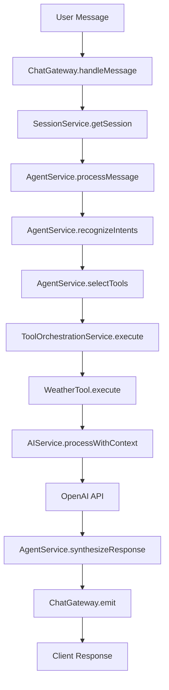
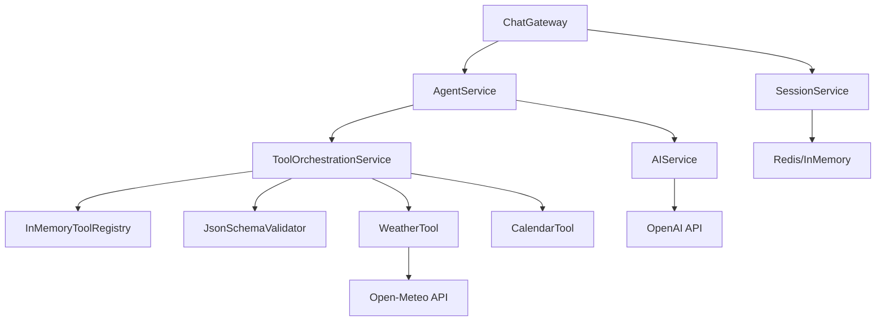

# 🚀 BrightSky AI Backend Architecture Documentation

## 📋 Table of Contents

1. [Overview](#overview)
2. [Project Structure](#project-structure)
3. [Core Modules](#core-modules)
4. [Data Flow & Call Chain](#data-flow--call-chain)
5. [API Endpoints](#api-endpoints)
6. [WebSocket Events](#websocket-events)
7. [Service Dependencies](#service-dependencies)
8. [Database Architecture](#database-architecture)
9. [Configuration](#configuration)
10. [Error Handling](#error-handling)

---

## 🎯 Overview

The BrightSky AI Backend is a **NestJS-based microservice architecture** that provides:

- **Real-time WebSocket communication** for chat interactions
- **AI-powered agent orchestration** with tool integration
- **MCP (Model Context Protocol) implementation** for tool management
- **Session management** with Redis/in-memory fallback
- **OpenAI integration** for natural language processing
- **Tool ecosystem** (Weather, Calendar, etc.)
- **Queue processing** with Bull
- **Health monitoring** and logging

---

## 📁 Project Structure

```
chatAI-backend/
├── src/
│   ├── agent/              # AI Agent orchestration
│   │   ├── agent.service.ts     # Main agent logic
│   │   └── agent.module.ts      # Agent module configuration
│   ├── auth/               # Authentication (placeholder)
│   │   └── auth.module.ts
│   ├── chat/               # WebSocket chat functionality
│   │   ├── chat.gateway.ts      # WebSocket gateway
│   │   └── chat.module.ts       # Chat module configuration
│   ├── common/             # Shared utilities
│   │   ├── filters/             # Exception filters
│   │   └── interceptors/        # Request/response interceptors
│   ├── config/             # Configuration management
│   │   └── env.validation.ts    # Environment validation
│   ├── database/           # Database configuration (placeholder)
│   │   └── database.module.ts
│   ├── health/             # Health checks (placeholder)
│   │   └── health.module.ts
│   ├── mcp/                # Model Context Protocol implementation
│   │   ├── interfaces/          # Core interfaces
│   │   ├── registry/            # Tool registry
│   │   ├── validators/          # Parameter validation
│   │   ├── tools/              # Tool implementations
│   │   ├── mcp.service.ts      # Tool orchestration service
│   │   ├── mcp.controller.ts   # REST API endpoints
│   │   └── mcp.module.ts       # MCP module configuration
│   ├── monitoring/         # Monitoring (placeholder)
│   │   └── monitoring.module.ts
│   ├── queue/              # Message queue processing
│   │   ├── queue.service.ts     # Queue management
│   │   └── queue.module.ts      # Queue module configuration
│   ├── redis/              # Redis configuration
│   │   └── redis.module.ts      # Redis client setup
│   ├── services/           # Business services
│   │   └── ai.service.ts        # OpenAI integration
│   ├── session/            # Session management
│   │   ├── session.service.ts   # Redis session management
│   │   ├── in-memory-session.service.ts  # Fallback session storage
│   │   └── session.module.ts    # Session module configuration
│   ├── app.module.ts       # Main application module
│   └── main.ts             # Application bootstrap
├── test/                   # Test files
├── logs/                   # Application logs
└── package.json           # Dependencies and scripts
```

---

## 🔧 Core Modules

### 1. **App Module** (`src/app.module.ts`)

**Purpose**: Main application configuration and module orchestration

**Key Features**:
- Database connection (PostgreSQL with TypeORM)
- Redis integration for caching/sessions
- Winston logging configuration
- Rate limiting with Throttler
- Bull queue integration
- CORS configuration
- Environment validation

**Dependencies**:
```typescript
ConfigModule,
TypeOrmModule,
WinstonModule,
ThrottlerModule,
BullModule,
RedisModule,
QueueModule,
AuthModule,
SessionModule,
HealthModule,
MonitoringModule,
ChatModule,
AgentModule,
McpModule
```

---

### 2. **Chat Module** (`src/chat/`)

#### **ChatGateway** (`src/chat/chat.gateway.ts`)

**Purpose**: WebSocket gateway for real-time chat communication

**Key Methods**:
- `handleConnection(socket: Socket)`: Establishes WebSocket connection
- `handleDisconnect(socket: Socket)`: Cleans up on disconnect
- `handleMessage(@MessageBody() data: UserMessageDto)`: Processes incoming messages
- `handleSessionCreate()`: Creates new chat session
- `handleSessionHistory()`: Retrieves conversation history
- `handleTyping()`: Handles typing indicators

**WebSocket Events**:
- `user_message`: Incoming user message
- `agent_thinking`: Agent processing status
- `agent_response`: AI agent response
- `tool_call`: Tool execution notification
- `error`: Error messages
- `session_created`: New session confirmation
- `typing`: Typing indicators

**Data Flow**:
1. Client connects → `handleConnection()` → Session created
2. User sends message → `handleMessage()` → Agent processing
3. Agent processes → Tool execution → AI response → Client

---

### 3. **Agent Module** (`src/agent/`)

#### **AgentService** (`src/agent/agent.service.ts`)

**Purpose**: Core AI agent orchestration and decision-making

**Key Methods**:
- `processMessage()`: Main message processing pipeline
- `recognizeIntents()`: Intent recognition from user input
- `selectTools()`: Tool selection based on intents
- `executeTools()`: Tool execution coordination
- `synthesizeResponse()`: AI-powered response generation

**Processing Pipeline**:
1. **Intent Recognition**: Analyze user message for intents
2. **Tool Selection**: Choose appropriate tools based on intents
3. **Tool Execution**: Execute selected tools via MCP service
4. **Response Synthesis**: Generate natural language response using AI

**Dependencies**:
- `ToolOrchestrationService`: Tool execution
- `AIService`: Natural language processing

---

### 4. **MCP Module** (`src/mcp/`)

#### **ToolOrchestrationService** (`src/mcp/mcp.service.ts`)

**Purpose**: Tool execution orchestration following MCP protocol

**Key Methods**:
- `execute<T>(toolName: string, params: Record<string, unknown>)`: Execute tool
- `callTool<T>(toolName: string, params: Record<string, unknown>)`: Alternative execution
- `getAvailableTools()`: Get all registered tools
- `getToolDefinition(toolName: string)`: Get specific tool definition

**Execution Flow**:
1. Tool lookup in registry
2. Parameter validation
3. Tool execution
4. Result formatting
5. Error handling

#### **McpController** (`src/mcp/mcp.controller.ts`)

**Purpose**: REST API endpoints for tool management

**Endpoints**:
- `POST /mcp/execute/:toolName`: Execute specific tool
- `GET /mcp/tools`: Get all available tools
- `GET /mcp/tools/:toolName`: Get tool definition

#### **Tool Registry** (`src/mcp/registry/tool.registry.ts`)

**Purpose**: Tool registration and management

**Key Methods**:
- `register(tool: ToolDefinition)`: Register new tool
- `get(toolName: string)`: Get tool definition
- `getAll()`: Get all registered tools
- `exists(toolName: string)`: Check tool existence

#### **Tools**

**WeatherTool** (`src/mcp/tools/weather.tool.ts`):
- `execute(params)`: Fetch weather data using Open-Meteo API
- Provides current weather conditions for any location

**CalendarTool** (`src/mcp/tools/calendar.tool.ts`):
- `execute(params)`: Calendar functionality (placeholder)

---

### 5. **Services Module** (`src/services/`)

#### **AIService** (`src/services/ai.service.ts`)

**Purpose**: OpenAI integration for natural language processing

**Key Methods**:
- `processWithContext()`: Process user message with tool context
- `buildToolContext()`: Format tool results for AI processing
- `formatWeatherContext()`: Format weather data for AI
- `createSystemPrompt()`: Generate system prompt for AI

**Processing Flow**:
1. Build context from tool results
2. Create system prompt
3. Format conversation history
4. Send to OpenAI API
5. Return processed response

---

### 6. **Session Module** (`src/session/`)

#### **SessionService** (`src/session/session.service.ts`)

**Purpose**: Redis-based session management

**Key Methods**:
- `createSession()`: Create new session
- `getSession(sessionId)`: Retrieve session data
- `updateSession()`: Update session information
- `deleteSession()`: Remove session
- `addMessage()`: Add message to conversation history

**Session Data Structure**:
```typescript
interface SessionData {
  userId?: string;
  conversationHistory: Array<{
    id: string;
    role: 'user' | 'assistant' | 'system';
    content: string;
    timestamp: Date;
    metadata?: Record<string, any>;
  }>;
  context: Record<string, any>;
  preferences: {
    theme?: string;
    language?: string;
    aiProvider?: string;
  };
  createdAt: Date;
  lastActivity: Date;
}
```

#### **InMemorySessionService** (`src/session/in-memory-session.service.ts`)

**Purpose**: Fallback session storage when Redis is unavailable

---

### 7. **Queue Module** (`src/queue/`)

#### **QueueService** (`src/queue/queue.service.ts`)

**Purpose**: Background job processing with Bull

**Queues**:
- `agent-processing`: AI agent processing jobs
- `tool-execution`: Tool execution jobs

**Key Methods**:
- `addJob()`: Add job to queue
- `processJob()`: Process queued jobs
- `getJobStatus()`: Check job status

---

### 8. **Redis Module** (`src/redis/`)

**Purpose**: Redis client configuration and connection management

**Features**:
- Connection pooling
- Automatic reconnection
- Graceful degradation to in-memory storage

---

## 🔄 Data Flow & Call Chain

### **Primary Message Flow**



### **Detailed Call Chain**

1. **WebSocket Connection**:
   ```
   Client → ChatGateway.handleConnection() → SessionService.createSession()
   ```

2. **Message Processing**:
   ```
   Client → ChatGateway.handleMessage() → 
   SessionService.getSession() → 
   AgentService.processMessage() → 
   AgentService.recognizeIntents() → 
   AgentService.selectTools() → 
   ToolOrchestrationService.execute() → 
   WeatherTool.execute() → 
   AIService.processWithContext() → 
   OpenAI API → 
   AgentService.synthesizeResponse() → 
   SessionService.addMessage() → 
   ChatGateway.emit() → 
   Client
   ```

3. **Tool Execution**:
   ```
   ToolOrchestrationService.execute() → 
   InMemoryToolRegistry.get() → 
   JsonSchemaValidator.validate() → 
   WeatherTool.execute() → 
   Open-Meteo API → 
   Result formatting
   ```

---

## 🌐 API Endpoints

### **REST API Endpoints**

#### **MCP Controller** (`/mcp`)

| Method | Endpoint | Description | Request Body | Response |
|--------|----------|-------------|--------------|----------|
| POST | `/mcp/execute/:toolName` | Execute specific tool | `{ params: Record<string, unknown> }` | `ToolCallResult` |
| GET | `/mcp/tools` | Get all available tools | None | `ToolDefinition[]` |
| GET | `/mcp/tools/:toolName` | Get tool definition | None | `ToolDefinition` |

#### **Example Requests**

**Execute Weather Tool**:
```bash
POST /mcp/execute/weather
Content-Type: application/json

{
  "params": {
    "location": "Tel Aviv, Israel"
  }
}
```

**Response**:
```json
{
  "success": true,
  "result": {
    "location": "Tel Aviv, Israel",
    "temperature": 24.7,
    "description": "Mainly clear",
    "humidity": 50,
    "wind": {
      "speed": 4,
      "direction": "south"
    }
  },
  "executionTime": 1250,
  "toolName": "weather"
}
```

---

## 🔌 WebSocket Events

### **Client → Server Events**

| Event | Data Structure | Description |
|-------|----------------|-------------|
| `user_message` | `{ content: string, metadata?: Record<string, any> }` | User sends message |
| `create_session` | `{ userId?: string }` | Create new session |
| `get_session_history` | `{ sessionId: string }` | Get conversation history |
| `typing_start` | `{ sessionId: string }` | User starts typing |
| `typing_stop` | `{ sessionId: string }` | User stops typing |

### **Server → Client Events**

| Event | Data Structure | Description |
|-------|----------------|-------------|
| `agent_thinking` | `{ content: string, metadata?: Record<string, any> }` | Agent processing status |
| `tool_call` | `{ toolName: string, params: Record<string, any> }` | Tool execution notification |
| `agent_response` | `{ content: string, metadata?: Record<string, any> }` | AI agent response |
| `error` | `{ message: string, code?: string }` | Error messages |
| `session_created` | `{ sessionId: string }` | New session confirmation |
| `session_history` | `{ messages: SessionMessage[] }` | Conversation history |

---

## 🔗 Service Dependencies

### **Dependency Graph**



### **Service Relationships**

1. **ChatGateway** depends on:
   - `SessionService` for session management
   - `AgentService` for message processing

2. **AgentService** depends on:
   - `ToolOrchestrationService` for tool execution
   - `AIService` for natural language processing

3. **ToolOrchestrationService** depends on:
   - `InMemoryToolRegistry` for tool management
   - `JsonSchemaValidator` for parameter validation
   - Individual tool implementations

4. **AIService** depends on:
   - `OpenAI API` for language processing
   - `ConfigService` for API configuration

---

## 🗄️ Database Architecture

### **PostgreSQL Configuration**

```typescript
TypeOrmModule.forRootAsync({
  useFactory: (config: ConfigService) => ({
    type: 'postgres',
    host: config.get<string>('DB_HOST', 'localhost'),
    port: config.get<number>('DB_PORT', 5432),
    username: config.get<string>('DB_USERNAME', 'postgres'),
    password: config.get<string>('DB_PASSWORD'),
    database: config.get<string>('DB_NAME', 'postgres'),
    ssl: { rejectUnauthorized: false },
    synchronize: config.get<string>('NODE_ENV') !== 'production',
    autoLoadEntities: true,
  }),
})
```

### **Redis Configuration**

```typescript
BullModule.forRootAsync({
  useFactory: (config: ConfigService) => ({
    redis: {
      host: config.get<string>('REDIS_HOST', 'localhost'),
      port: config.get<number>('REDIS_PORT', 6379),
      password: config.get<string>('REDIS_PASSWORD'),
    },
  }),
})
```

---

## ⚙️ Configuration

### **Environment Variables**

```env
# Server Configuration
PORT=3001
NODE_ENV=development

# Database Configuration
DB_HOST=localhost
DB_PORT=5432
DB_USERNAME=postgres
DB_PASSWORD=your_password
DB_NAME=postgres

# Redis Configuration
REDIS_HOST=localhost
REDIS_PORT=6379
REDIS_PASSWORD=your_redis_password

# AI Services
OPENAI_API_KEY=your_openai_key

# Security
JWT_SECRET=your_jwt_secret

# External APIs
WEATHER_API_KEY=your_weather_key
```

### **Configuration Validation**

```typescript
// src/config/env.validation.ts
export function validate(config: Record<string, unknown>) {
  const validatedConfig = plainToClass(EnvironmentVariables, config, {
    enableImplicitConversion: true,
  });
  
  const errors = validateSync(validatedConfig, {
    skipMissingProperties: false,
  });
  
  if (errors.length > 0) {
    throw new Error(errors.toString());
  }
  
  return validatedConfig;
}
```

---

## 🛡️ Error Handling

### **Global Exception Filter**

```typescript
// src/common/filters/all-exceptions.filter.ts
@Catch()
export class AllExceptionsFilter implements ExceptionFilter {
  catch(exception: unknown, host: ArgumentsHost) {
    const ctx = host.switchToHttp();
    const response = ctx.getResponse();
    const request = ctx.getRequest();
    
    const status = exception instanceof HttpException
      ? exception.getStatus()
      : HttpStatus.INTERNAL_SERVER_ERROR;
    
    response.status(status).json({
      statusCode: status,
      timestamp: new Date().toISOString(),
      path: request.url,
      message: exception.message || 'Internal server error',
    });
  }
}
```

### **Error Types**

1. **Validation Errors**: Parameter validation failures
2. **Tool Execution Errors**: Tool-specific failures
3. **API Errors**: External API communication failures
4. **Session Errors**: Session management issues
5. **WebSocket Errors**: Connection/communication errors

---

## 🚀 Getting Started

### **Installation**

```bash
# Install dependencies
npm install

# Set up environment variables
cp .env.example .env

# Run database migrations
npm run migration:run

# Start the application
npm run start:dev
```

### **Development Commands**

```bash
# Development mode
npm run start:dev

# Production build
npm run build

# Run tests
npm run test

# Run linting
npm run lint

# Generate documentation
npm run doc
```

---

## 📊 Performance Considerations

1. **Redis Caching**: Session data cached for fast retrieval
2. **Connection Pooling**: Database connection optimization
3. **Queue Processing**: Background job processing
4. **Rate Limiting**: Request throttling (100 requests/minute)
5. **WebSocket Optimization**: Efficient real-time communication

---

## 🔍 Monitoring & Logging

### **Winston Logging**

```typescript
WinstonModule.forRoot({
  transports: [
    new winston.transports.Console({
      format: winston.format.combine(
        winston.format.timestamp(),
        winston.format.colorize(),
        winston.format.simple(),
      ),
    }),
  ],
})
```

### **Health Checks**

- Database connectivity
- Redis availability
- External API status
- Queue processing status

---

## 🏗️ SOLID Principles Implementation

The backend follows SOLID principles:

1. **Single Responsibility**: Each service has one clear responsibility
2. **Open/Closed**: Extensible for new tools/features
3. **Liskov Substitution**: Interfaces enable component substitution
4. **Interface Segregation**: Focused, specific interfaces
5. **Dependency Inversion**: High-level modules depend on abstractions

---

This documentation provides a comprehensive overview of the BrightSky AI Backend architecture, including all modules, services, data flows, and implementation details. The system is designed for scalability, maintainability, and extensibility while following modern NestJS best practices.
