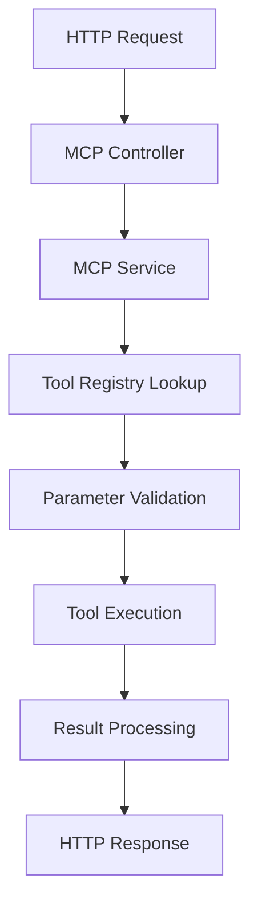

# MCP (Model Context Protocol) Architecture Documentation

## Overview

The MCP (Model Context Protocol) system is a SOLID-principles-based architecture designed to provide a flexible, extensible, and type-safe framework for AI agents to interact with various tools and services. This system enables dynamic tool registration, parameter validation, and standardized execution flow.

## 📁 Folder Structure

```
src/mcp/
├── interfaces/          # Core type definitions and contracts
│   └── tool.interface.ts
├── registry/           # Tool registration and management
│   └── tool.registry.ts
├── validators/         # Parameter validation logic
│   └── parameter.validator.ts
├── tools/             # Tool implementations
│   ├── base/          # Abstract base classes
│   │   └── base.tool.ts
│   ├── weather.tool.ts    # Weather-related functionality
│   └── calendar.tool.ts   # Calendar-related functionality
├── mcp.service.ts     # Main service orchestrator
├── mcp.controller.ts  # HTTP API endpoints
└── mcp.module.ts      # NestJS module configuration
```

## 🔧 Core Components

### 1. **interfaces/tool.interface.ts**

**Purpose**: Defines the foundational contracts and types for the entire MCP system.

**Key Interfaces:**

- `ToolCallResult<T>`: Standardized response format for tool execution
- `ParameterDefinition`: Schema for tool parameter specifications
- `ToolDefinition`: Complete tool specification including execution function
- `ToolRegistry`: Contract for tool registration and retrieval
- `ParameterValidator`: Contract for parameter validation logic
- `ToolExecutor`: Contract for tool execution orchestration

**Methods & Properties:**

```typescript
interface ToolCallResult<T = unknown> {
  success: boolean; // Execution success status
  result?: T; // Actual result data
  error?: string; // Error message if failed
  executionTime?: number; // Performance metrics
  metadata?: Record<string, unknown>; // Additional context
}

interface ParameterDefinition {
  type: 'string' | 'number' | 'boolean' | 'object' | 'array';
  description: string; // Human-readable description
  required?: boolean; // Whether parameter is mandatory
  enum?: string[]; // Allowed values (if applicable)
  format?: string; // Additional format constraints
}
```

### 2. **registry/tool.registry.ts**

**Purpose**: In-memory tool registry implementing the ToolRegistry interface for dynamic tool management.

**Key Methods:**

- `register(tool: ToolDefinition)`: Adds a new tool to the registry
- `unregister(toolName: string)`: Removes a tool from the registry
- `get(toolName: string)`: Retrieves a specific tool by name
- `getAll()`: Returns all registered tools
- `getNames()`: Returns all tool names
- `has(toolName: string)`: Checks if a tool exists
- `clear()`: Removes all tools from registry

**Implementation Details:**

```typescript
@Injectable()
export class InMemoryToolRegistry implements ToolRegistry {
  private readonly tools = new Map<string, ToolDefinition>();
  private readonly logger = new Logger(InMemoryToolRegistry.name);

  register(tool: ToolDefinition): void {
    this.tools.set(tool.name, tool);
    this.logger.log(`Tool registered: ${tool.name}`);
  }
  // ... other methods
}
```

### 3. **validators/parameter.validator.ts**

**Purpose**: Validates tool parameters against their schema definitions using JSON Schema validation.

**Key Methods:**

- `validate(tool: ToolDefinition, params: Record<string, unknown>)`: Validates parameters against tool schema
- `validateParameter(param: unknown, definition: ParameterDefinition)`: Validates individual parameter
- `validateRequired(params: Record<string, unknown>, tool: ToolDefinition)`: Checks required parameters

**Validation Flow:**

1. Check required parameters are present
2. Validate parameter types match schema
3. Validate enum constraints (if applicable)
4. Validate format constraints (if applicable)
5. Return comprehensive validation result

### 4. **tools/base/base.tool.ts**

**Purpose**: Abstract base class providing common functionality for all tool implementations.

**Key Features:**

- Type-safe parameter extraction
- Parameter validation helpers
- Standardized tool definition generation
- Error handling utilities

**Abstract Properties:**

```typescript
abstract readonly name: string;        // Tool identifier
abstract readonly description: string; // Tool description
abstract readonly parameters: Record<string, ParameterDefinition>; // Parameter schema
```

**Abstract Methods:**

```typescript
abstract execute(params: Record<string, unknown>): Promise<unknown>;
```

**Helper Methods:**

```typescript
protected getParam<T>(params: Record<string, unknown>, key: string, defaultValue?: T): T
protected validateRequiredParams(params: Record<string, unknown>, requiredParams: string[]): void
```

### 5. **tools/weather.tool.ts**

**Purpose**: Concrete implementation for weather-related functionality.

**Parameters:**

- `location` (string, required): Geographic location
- `units` (string, optional): Temperature units (metric/imperial)

**Functionality:**

- Fetches current weather conditions
- Provides temperature, humidity, wind speed
- Supports multiple unit systems

### 6. **tools/calendar.tool.ts**

**Purpose**: Concrete implementation for calendar-related functionality.

**Parameters:**

- `action` (string, required): Calendar action (create, read, update, delete)
- `date` (string, required): Target date
- `event` (object, optional): Event details

**Functionality:**

- Creates calendar events
- Retrieves calendar information
- Manages scheduling operations

### 7. **mcp.service.ts**

**Purpose**: Main orchestration service implementing the ToolExecutor interface, renamed to **ToolOrchestrationService** to better reflect its role as a tool orchestrator rather than a true MCP client.

**Key Methods:**

- `execute<T>(toolName: string, params: Record<string, unknown>)`: Main execution method
- `callTool<T>(toolName: string, params: Record<string, unknown>)`: Alternative execution method
- `getAvailableTools()`: Returns list of available tools
- `getToolDefinition(toolName: string)`: Returns specific tool definition

**Execution Flow:**

1. **Tool Lookup**: Retrieve tool from registry
2. **Parameter Validation**: Validate parameters against schema
3. **Tool Execution**: Execute tool with validated parameters
4. **Result Processing**: Format and return standardized result
5. **Error Handling**: Catch and format any errors
6. **Performance Tracking**: Measure execution time

**Dependencies (via Dependency Injection):**

- `@Inject('TOOL_REGISTRY')`: Tool registry instance
- `@Inject('PARAMETER_VALIDATOR')`: Parameter validator instance

**Note**: This service has been renamed from `McpService` to `ToolOrchestrationService` to better represent its actual function as a tool orchestrator rather than a true MCP client.

### 8. **mcp.controller.ts**

**Purpose**: HTTP API controller exposing MCP functionality via REST endpoints.

**Endpoints:**

- `POST /mcp/execute/:toolName`: Execute a specific tool
- `GET /mcp/tools`: Get all available tools
- `GET /mcp/tools/:toolName`: Get specific tool definition

**Request/Response Flow:**

1. HTTP request received
2. Extract tool name and parameters
3. Delegate to McpService
4. Return formatted HTTP response

### 9. **mcp.module.ts**

**Purpose**: NestJS module configuration defining providers and dependencies.

**Providers:**

- `McpService`: Main service
- `InMemoryToolRegistry`: Tool registry implementation
- `JsonSchemaValidator`: Parameter validator implementation
- `WeatherTool`: Weather tool instance
- `CalendarTool`: Calendar tool instance

**Module Setup:**

```typescript
@Module({
  controllers: [McpController],
  providers: [
    McpService,
    {
      provide: 'TOOL_REGISTRY',
      useClass: InMemoryToolRegistry,
    },
    {
      provide: 'PARAMETER_VALIDATOR',
      useClass: JsonSchemaValidator,
    },
    WeatherTool,
    CalendarTool,
  ],
  exports: [McpService],
})
```

## 🔄 Execution Flow

### High-Level Flow



### Detailed Step-by-Step Flow

1. **Request Initiation**

   - Client sends HTTP POST to `/mcp/execute/:toolName`
   - Controller receives request with tool name and parameters

2. **Service Orchestration**

   - `McpController` calls `McpService.execute(toolName, params)`
   - Service starts execution timer for performance tracking

3. **Tool Discovery**

   - Service queries `ToolRegistry.get(toolName)`
   - Registry performs Map lookup for tool definition
   - Returns ToolDefinition or undefined

4. **Parameter Validation**

   - Service calls `ParameterValidator.validate(tool, params)`
   - Validator checks required parameters
   - Validates parameter types and constraints
   - Returns ValidationResult with success/error details

5. **Tool Execution**

   - Service calls `tool.execute(params)`
   - BaseTool validates parameters using helper methods
   - Concrete tool performs business logic
   - Returns execution result

6. **Result Processing**

   - Service wraps result in ToolCallResult format
   - Adds execution time and metadata
   - Handles any errors with proper formatting

7. **Response Generation**
   - Controller receives ToolCallResult
   - Formats HTTP response with appropriate status codes
   - Returns JSON response to client

## 🏗️ SOLID Principles Implementation

### Single Responsibility Principle (SRP)

- Each class has one specific responsibility
- `ToolRegistry`: Only manages tool registration
- `ParameterValidator`: Only validates parameters
- `McpService`: Only orchestrates execution

### Open/Closed Principle (OCP)

- System is open for extension (new tools)
- Closed for modification (core interfaces unchanged)
- New tools extend `BaseTool` without modifying existing code

### Liskov Substitution Principle (LSP)

- All tool implementations can be substituted for `BaseTool`
- All registry implementations can be substituted for `ToolRegistry`
- All validators can be substituted for `ParameterValidator`

### Interface Segregation Principle (ISP)

- Interfaces are focused and specific
- Tools only implement necessary methods
- Clients depend only on interfaces they use

### Dependency Inversion Principle (DIP)

- High-level modules depend on abstractions
- `McpService` depends on `ToolRegistry` interface, not concrete implementation
- Dependency injection provides concrete implementations

## 🔒 Type Safety & Error Handling

### Type Safety Features

- Generic return types for tool results
- Strict parameter validation
- TypeScript interfaces for all contracts
- Runtime type checking with validation

### Error Handling Strategy

- Standardized error responses
- Graceful degradation for missing tools
- Parameter validation errors
- Execution timeout handling
- Comprehensive logging

## 🚀 Extension Points

### Adding New Tools

1. Create new class extending `BaseTool`
2. Implement required abstract methods
3. Define parameter schema
4. Add to module providers
5. Register in module initialization

### Adding New Validators

1. Implement `ParameterValidator` interface
2. Add custom validation logic
3. Register as provider in module
4. Inject into service

### Adding New Registry Types

1. Implement `ToolRegistry` interface
2. Add storage mechanism (database, Redis, etc.)
3. Register as provider in module
4. Inject into service

## 📊 Performance Considerations

- **In-Memory Registry**: Fast tool lookup with O(1) complexity
- **Execution Timing**: Built-in performance metrics
- **Parameter Validation**: Efficient JSON schema validation
- **Error Handling**: Minimal overhead for success cases
- **Logging**: Structured logging for debugging and monitoring

## 🔍 Monitoring & Debugging

- **Structured Logging**: All major operations logged
- **Performance Metrics**: Execution time tracking
- **Error Tracking**: Comprehensive error information
- **Tool Usage Analytics**: Built-in usage tracking
- **Validation Insights**: Parameter validation feedback

This architecture provides a robust, scalable, and maintainable foundation for AI agent tool interaction while adhering to SOLID principles and best practices.
